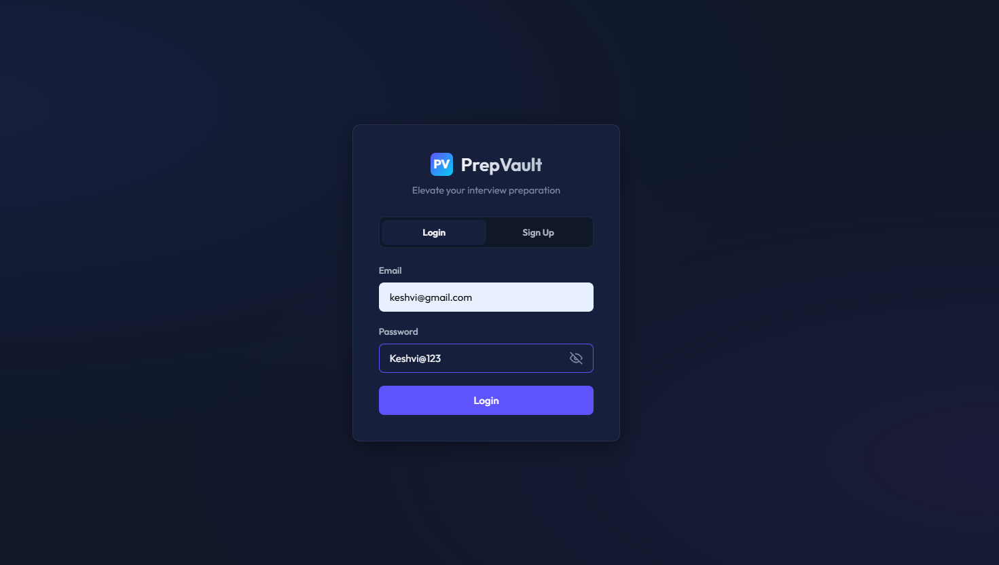
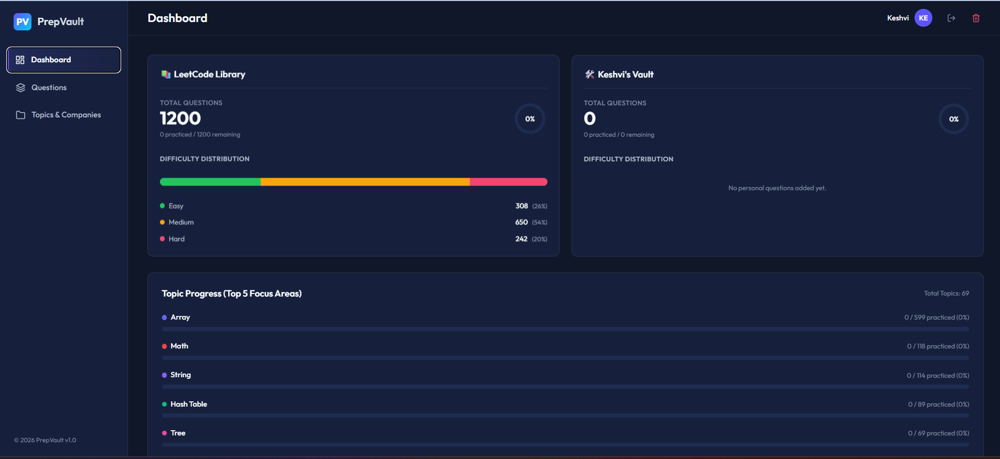
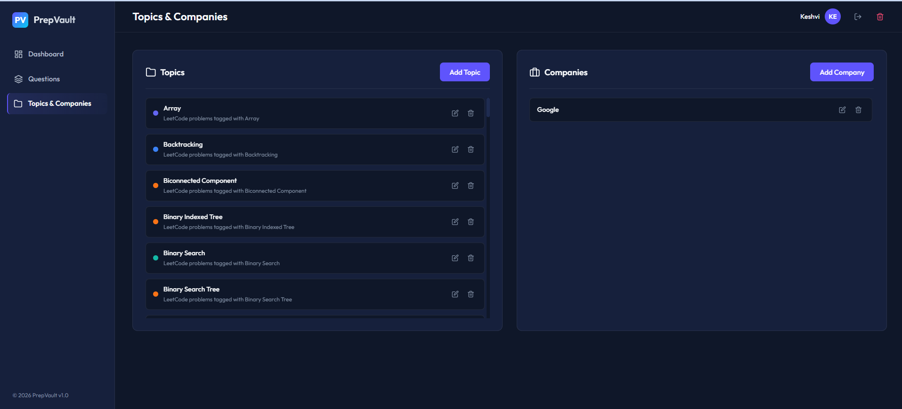
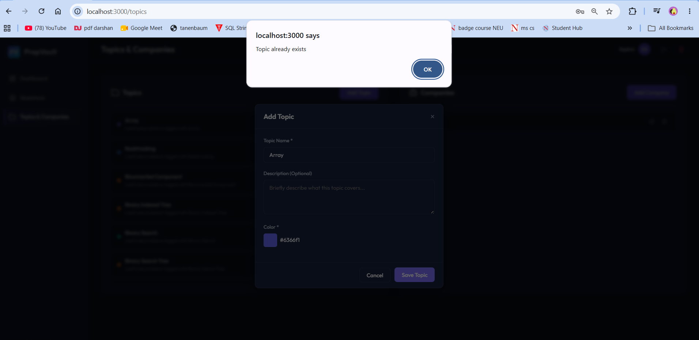
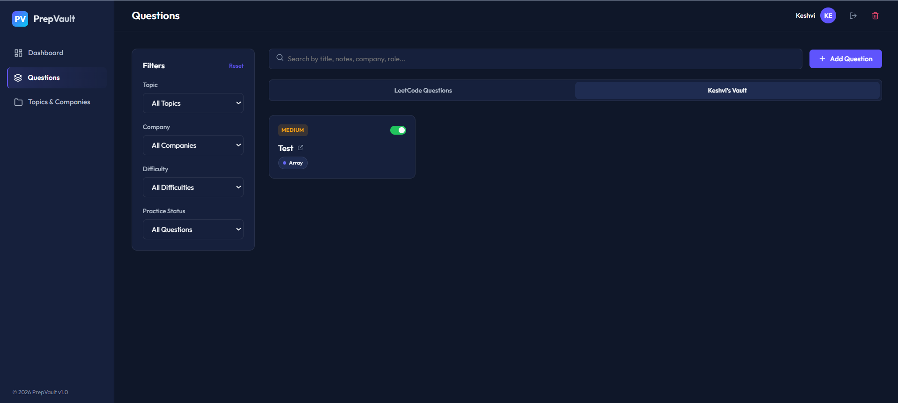
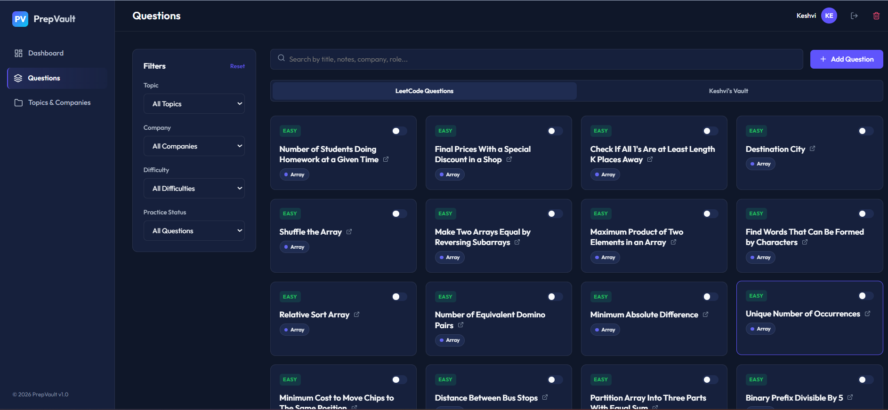
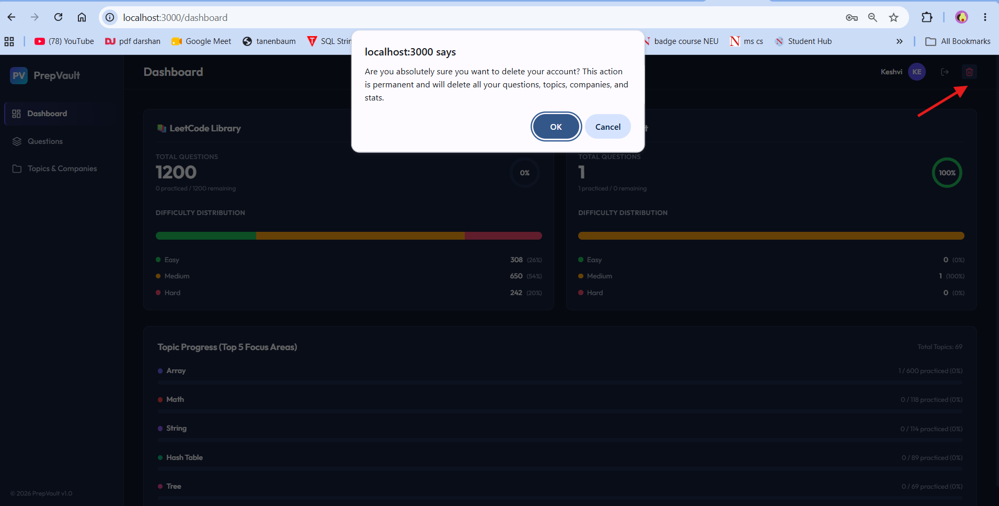

# PrepVault 

A premium, interactive personal interview preparation web application designed for graduate students to manage coding/system design questions, log company appearances, track practice progress, and filter study lists effectively.

---

## Course & Author Details

- **Class Link**: [CS5610 Web Development (Summer 2026) at Northeastern University](https://northeastern.instructure.com/courses/249954)
- **Authors**: Neeraja Joshi & Keshvi Choksi
- **Project Objective**: To build a robust, responsive web application that helps students navigate recruiting by organizing practice questions, noting optimal approaches, tracking company-specific data, and visualizing preparation progress.

---

## Screenshots

### 1. Authentication View (Login/Signup)

Our login and signup card supporting password validation rules and password visibility toggling.



### 2. Initial Dashboard (Auto-Seeded on Signup)

Our dashboard view immediately after a new user signs up. The 1,200 LeetCode questions are automatically populated, while the Personal Vault is empty until the user adds custom questions.



### 3. Topics & Companies Management Page

Our interface for adding custom topics with a color picker, as well as managing target companies.



### 4. Case-Insensitive Deduplication Alert

An example of our case-insensitive warning alert when trying to insert a duplicate topic.



### 5. Segregated Questions Grid and Filtering

Our questions tab showing the toggle tabs separating LeetCode Questions and the personal Vault, along with live search and sidebar filters.





### 6. Account Deletion and Cascade Cleanup

Our account settings option that allows users to permanently delete their account along with a cascading cleanup of all their logged questions, custom topics, companies, and sessions.



---

## Key Features

### 1. Dashboard & Progress Analytics

- **Split Dashboards**: Tracks statistics, practiced counts, and difficulty distributions separately for the pre-seeded **LeetCode Questions** and your own **Personal Vault**.
- **Interactive SVG Progress Ring**: Visualizes completion percentage on practice goals.
- **Topic Focus & Gap Analysis**: Displays linear progress bars indicating completion rates in each topic area.
- **Difficulty Distribution**: Color-coded segmented bar charts for Easy, Medium, and Hard problem spreads.

### 2. Segregated Questions List & Toggle Tabs

- **Segregated Vaults**: Switch tabs to show either **LeetCode Questions** (seeded) or **Username's Vault** (custom user questions).
- **Live Search**: Instantly filters problems by title, personal notes, company, or role.
- **Multi-key Sorting**: List is sorted alphabetically by Topic Name (uncategorized at the bottom), then within each topic sorted by difficulty (Easy -> Medium -> Hard), and finally by date created (newest first).
- **Sidebar Filters**: Refine list items by topic, company name, difficulty level, and practice status.
- **Practice Toggles**: Check off practiced questions straight from cards to update dashboard stats.

### 3. Detail Slide-over Panel

- **Autosaving Personal Notes**: Write solution approaches or complexity notes with a debounced, automated save-on-type text editor.
- **Company Appearances Log**: Attach and remove interview details including company name, role level, and target year.

### 4. Topics & Companies Custom CRUD

- **Topics Management**: Create topics and assign custom badge colors with an interactive color picker.
- **Deduplication Validation**: Prevents adding duplicate topics or questions case-insensitively.
- **Cascading Delete**: Removing a company automatically cascades and cleans up all logged appearances on questions.
- **Cascading Account Deletion**: Users can delete their account which will completely purge all their custom questions, topics, companies, and active sessions from the MongoDB database.

---

## Directory Structure

The project has been organized into separate `frontend` and `backend` layers for clean modularity:

```
project 2/
├── backend/                  # Server-side logic
│   ├── middleware/           # Express middleware (Auth validation)
│   │   └── auth.js
│   ├── routes/               # API Router endpoints
│   │   ├── auth.js
│   │   ├── companies.js
│   │   ├── questions.js
│   │   └── topics.js
│   ├── db.js                 # Native MongoDB Connection client
│   └── server.js             # Express application server entrypoint
├── frontend/                 # Client-side code
│   └── public/               # Static SPA assets (HTML, CSS, JS)
│       ├── css/              # View-specific CSS stylesheets
│       ├── img/              # Images and mockups
│       ├── js/               # SPA Router and view scripts
│       └── index.html        # SPA entry markup
├── .env                      # Configuration parameters
├── eslint.config.js          # ESLint rules
├── package.json              # NPM dependencies & running scripts
└── README.md                 # Project README
```

---

## Build & Run Instructions

### Prerequisites

- Node.js installed (v18+ recommended)
- MongoDB connection string (Atlas or local instance)

### Installation

1. Navigate to the project directory:
   ```bash
   cd "project 2"
   ```
2. Install dependencies:
   ```bash
   npm install
   ```

### Configuration

Create a `.env` file in the root directory:

```env
PORT=3000
MONGODB_URI=mongodb+srv://<username>:<password>@cluster.mongodb.net/prepvault
```

### Run the App

- **Development mode** (with node live reload):
  ```bash
  npm run dev
  ```
- **Production mode**:
  ```bash
  npm start
  ```

Once started, open [http://localhost:3000](http://localhost:3000) in your browser.

---

## Code Quality & Formatting

- Code validation: `npm run lint`
- Code formatting: `npm run format`
