# Natyakosha Design Document 

## 1. Project Description

Natyakosha is a web app for a Bharatanatyam teacher and her online students. Right now teachers like her manage everything through notebooks and WhatsApp: attendance on paper, fees in a diary, and mudra/adavu references sent as random photos whenever a student asks. Our app puts all of it in one place: a learning section with basic theory, mudras, and adavus (with images/videos), plus an admin side where the teacher runs her daily batches, marks attendance, and tracks who's paid their fees. Students log in to see the material and check their own attendance and fee status.

---

## 2. User Personas

### Persona A: Neeraja

Neeraja teaches Bharatanatyam online and runs four batches back to back every evening (4 to 5, 5 to 6, 6 to 7, 7 to 8 PM). She currently marks attendance on paper and keeps fee records in a notebook, and re-sends the same mudra photos over WhatsApp whenever someone asks. She wants one place to manage batches, mark attendance during class, and see who owes fees without digging through old messages.

### Persona B: Keshvi

Keshvi is one of Neeraja's students. She works full time and takes the 6 to 7 PM batch twice a week. She often forgets which adavu was covered last class and wants something she can go back to instead of texting her teacher. She also wants to check her fee status herself instead of asking.

---

## 3. User Stories & Use Cases

### Story 1
Neeraja starts her 6 PM class, opens the batch roster, and marks each student present or absent before class even begins.

### Story 2
Neeraja teaches a new adavu and adds it to the app with a short video link so students can go back and watch it later.

### Story 3
Keshvi logs in after class and rewatches the adavu video instead of messaging Neeraja to ask what was taught.

### Story 4
Keshvi checks her dashboard near the end of the month, sees her fee is due, and pays without needing to ask Neeraja first.

### Story 5
Neeraja checks her fee dashboard at the start of the month and sees at a glance which of her students across all four batches still owe fees.

---

## 4. Design Mockups

Below are the mockups displaying the responsive layout of Natyakosha:

### 4.1 Authentication View (Login)
Our login interface supports session-based authentication, validation rules, and password visibility toggling.

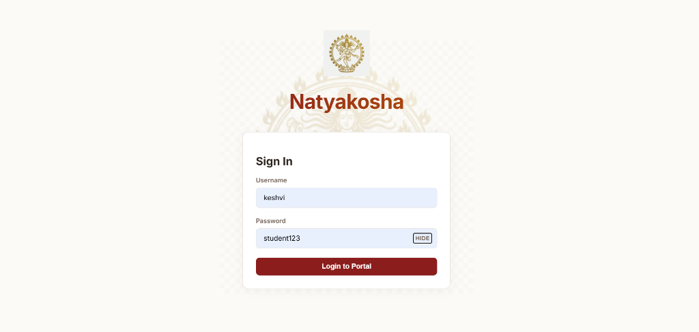

### 4.2 Student Learning Area (Theory & Texts)
The learning workspace displays the Theory & Texts section containing reference treatises, origin histories, and accordion text cards.

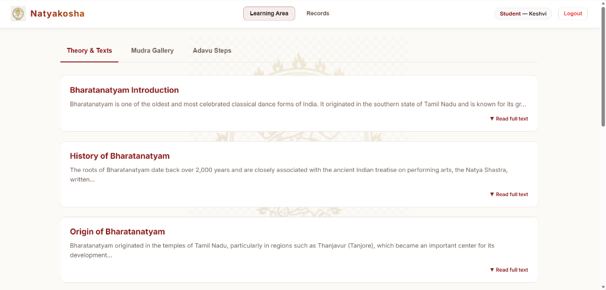

### 4.3 Student Performance Dashboard & Attendance Standing
Features a custom circular presence rate ring and a ledger showing the student's history register.

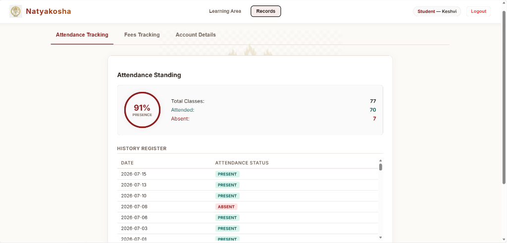

### 4.4 Student Fee Ledger
A tuition tracking invoice list enabling students to check payment statuses and process monthly tuition payments.

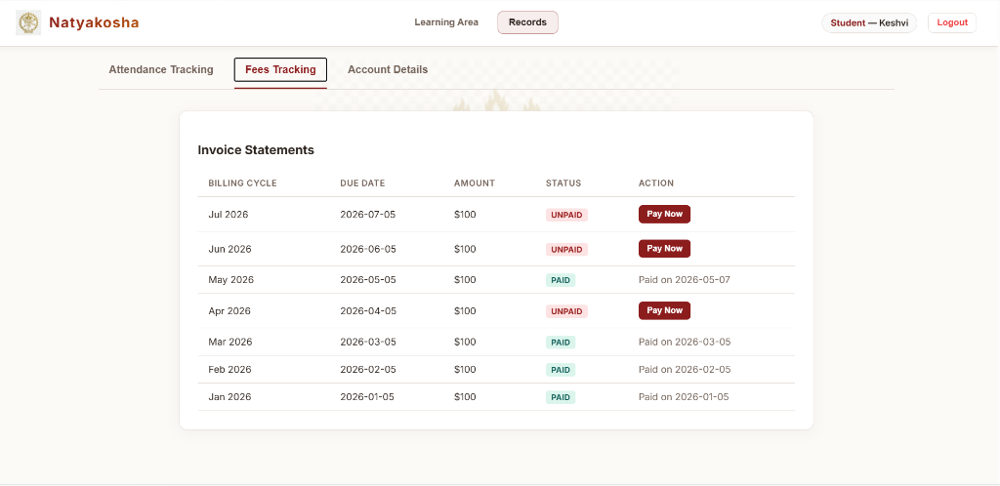

### 4.5 Student Account Details
The student profile details view displaying registration metadata, username, account creation timestamp, and a change password utility form.

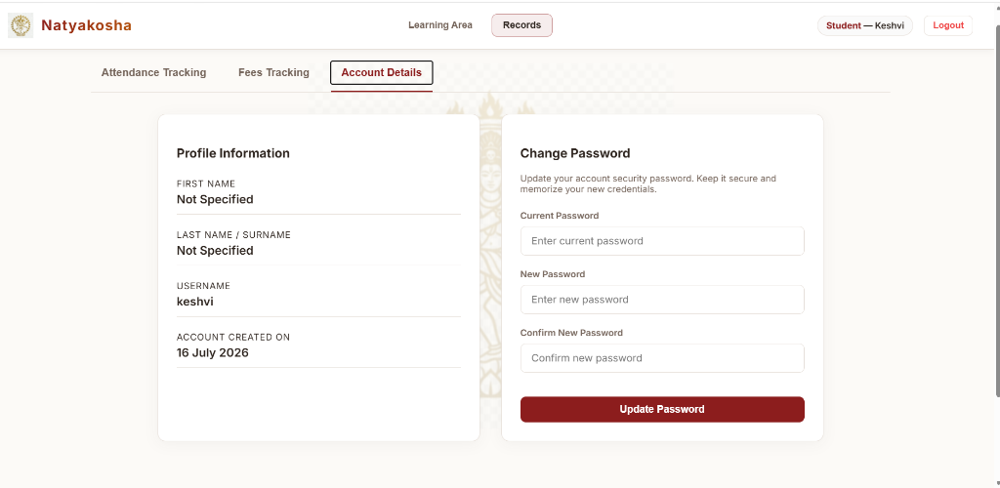

### 4.6 Curriculum Creator & Editor
An administrative form interface for instructors to add, edit, and remove curriculum materials.

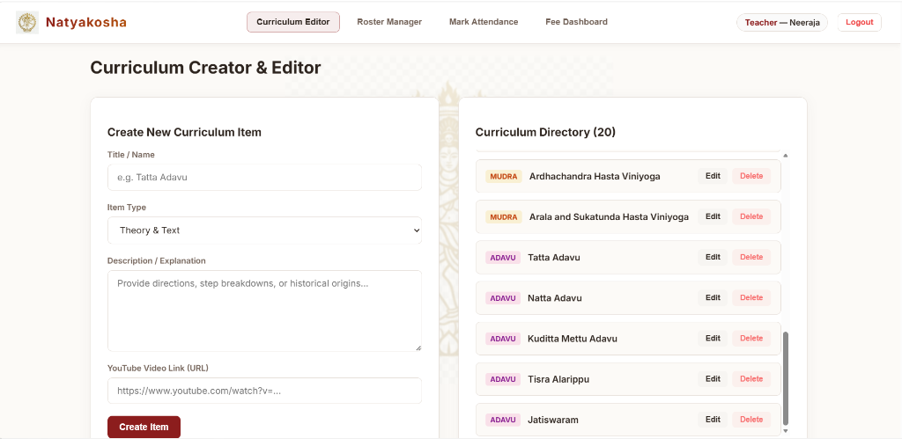

### 4.7 Roster & Batch Manager
The batch coordinator interface used to enroll students, register new student profiles, and manage evening schedules.

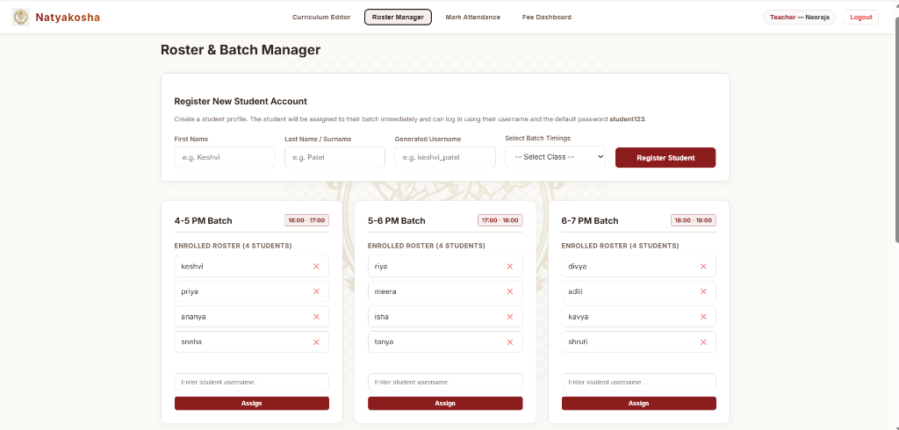

### 4.8 Batch Attendance Register
A digital attendance ledger used by instructors to select batch rosters and check off student presence logs.

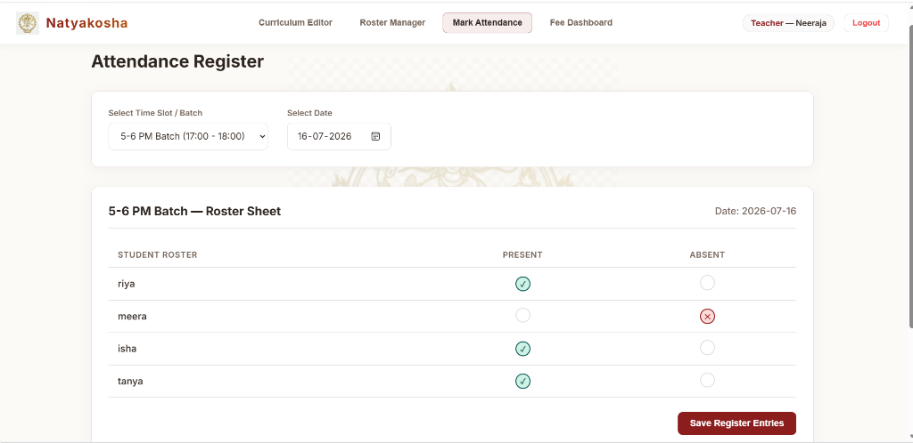

### 4.9 Fee Management Dashboard
The financial panel displaying total collections, outstanding invoice lists, and batch filters.

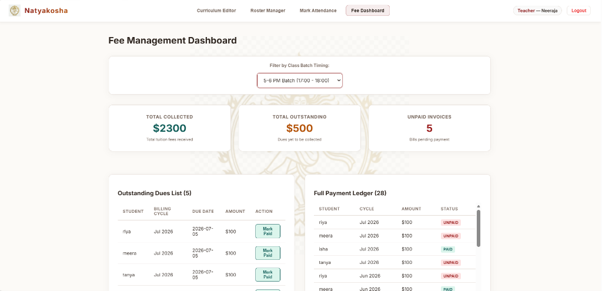

### 4.10 Student Learning Area (Mudra Gallery)
The learning workspace displays the Mudra Gallery containing hand gestures (Asamyukta Hastas) with descriptions and reference videos.

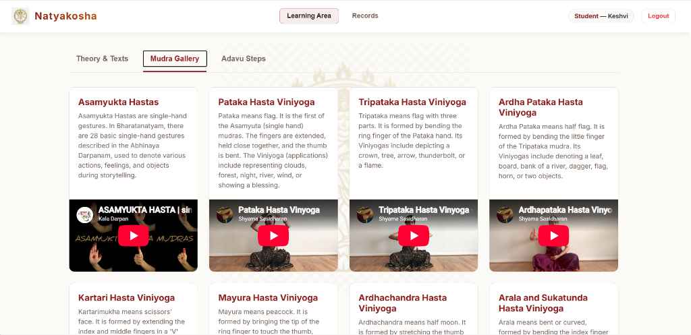

### 4.11 Student Learning Area (Adavu Steps)
The learning workspace displays the Adavu Steps page containing tutorial cards with embedded YouTube videos for rhythmic steps.

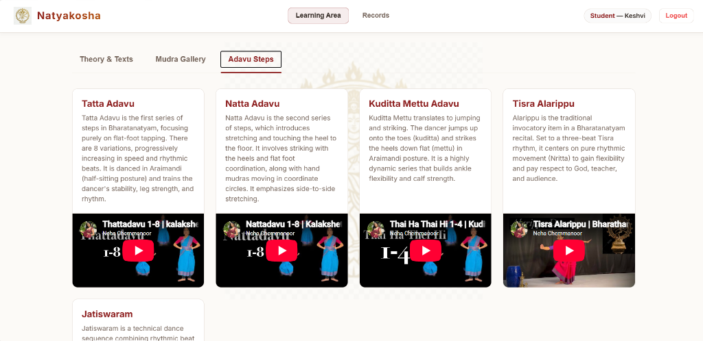

---

## 5. Work Distribution

### 5.1 Neeraja: Curriculum & Batches

- **Backend**:
  - Express and MongoDB routes for the content collection (theory, mudras, adavus, full CRUD)
  - Express and MongoDB routes for the batches collection (time slots, student roster)
  - Passport login and registration setup
  - Route protection on her own content and batch routes
  - Seed script for content and batch data
- **Frontend**:
  - Theory page, mudra gallery, adavu list, and the teacher's add/edit content and manage batches pages

### 5.2 Keshvi: Attendance & Fees

- **Backend**:
  - Express and MongoDB routes for the attendance collection (student, batch, date, status, full CRUD)
  - Express and MongoDB routes for the fee_payments collection (student, plan type, amount, paid status, full CRUD)
  - Logic to calculate due and paid status and attendance summaries per batch
  - Route protection on her own attendance and fee routes
  - Seed script generating 1,000+ attendance and payment records
- **Frontend**:
  - Attendance register, teacher's fee dashboard, and the student's own attendance and fee views

---

## 6. Technology Stack

- **Frontend**: React (Hooks)
- **Backend**: Node.js and Express
- **Database**: MongoDB (native driver, no Mongoose)
- **Auth**: Passport (local strategy)
